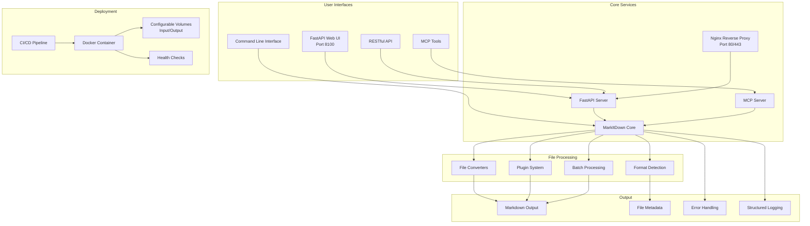
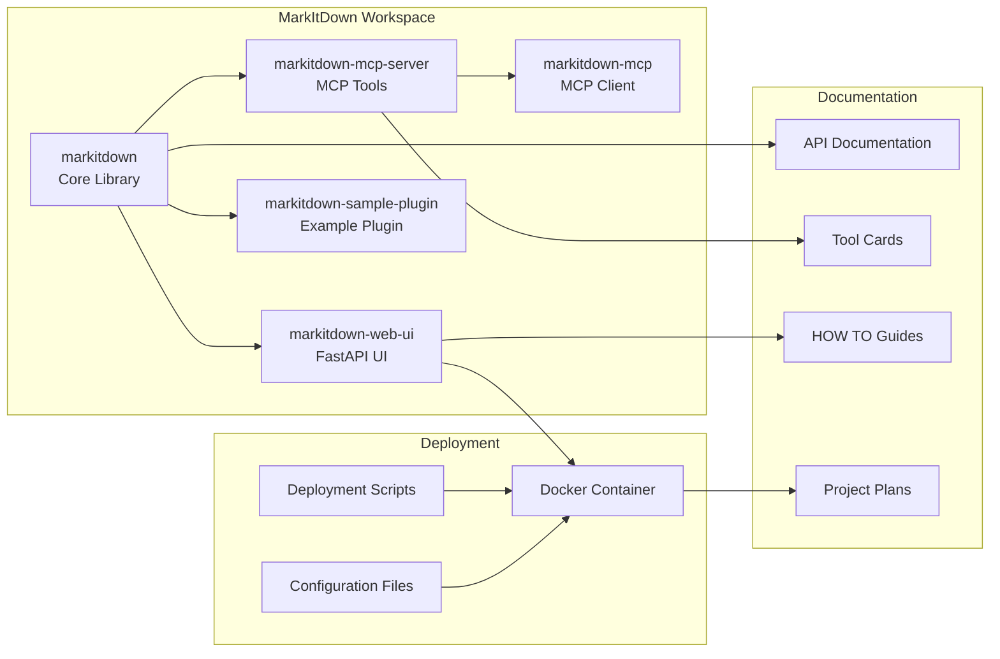
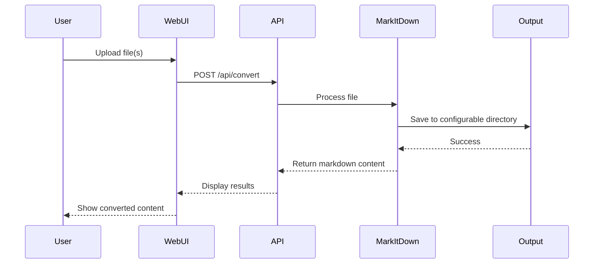
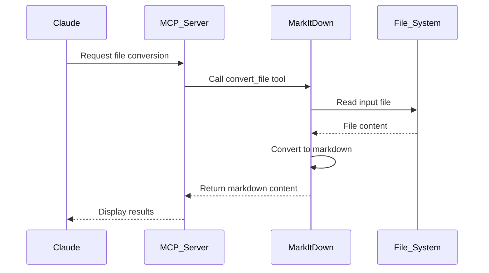
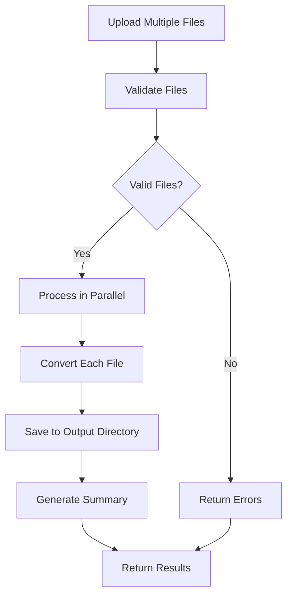
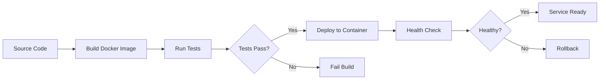

# MarkItDown

[](https://pypi.org/project/markitdown/)

[](https://github.com/microsoft/autogen)

> [!TIP]
> MarkItDown now offers an MCP (Model Context Protocol) server and FastAPI web UI for enhanced integration and user experience. See [MCP Tools](#mcp-tools) and [Web UI](#web-ui) sections for more information.

> [!IMPORTANT]
> Breaking changes between 0.0.1 to 0.1.0:
> * Dependencies are now organized into optional feature-groups (further details below). Use `pip install 'markitdown[all]'` to have backward-compatible behavior. 
> * convert\_stream() now requires a binary file-like object (e.g., a file opened in binary mode, or an io.BytesIO object). This is a breaking change from the previous version, where it previously also accepted text file-like objects, like io.StringIO.
> * The DocumentConverter class interface has changed to read from file-like streams rather than file paths. *No temporary files are created anymore*. If you are the maintainer of a plugin, or custom DocumentConverter, you likely need to update your code. Otherwise, if only using the MarkItDown class or CLI (as in these examples), you should not need to change anything.

MarkItDown is a lightweight Python utility for converting various files to Markdown for use with LLMs and related text analysis pipelines. To this end, it is most comparable to [textract](https://github.com/deanmalmgren/textract), but with a focus on preserving important document structure and content as Markdown (including: headings, lists, tables, links, etc.) While the output is often reasonably presentable and human-friendly, it is meant to be consumed by text analysis tools -- and may not be the best option for high-fidelity document conversions for human consumption.

## 🚀 New Features

### MCP (Model Context Protocol) Tools
MarkItDown now provides MCP tools for seamless integration with LLM applications like Claude Desktop:

- **File Conversion**: Convert individual files to Markdown
- **Batch Processing**: Convert multiple files simultaneously
- **Format Detection**: Automatically detect file formats
- **Plugin Management**: List and manage available plugins
- **Supported Formats**: Get comprehensive format support information

### FastAPI Web UI
A modern web interface for easy file conversion:

- **Drag & Drop**: Simple file upload interface
- **Batch Processing**: Convert multiple files at once
- **Real-time Updates**: Monitor conversion progress
- **RESTful API**: Programmatic access to all features
- **Auto-detection**: Automatic format detection and conversion
- **Configurable Directories**: Map local folders for input/output
- **Port 8100**: Exposed to local PC for easy access

### Production-Ready Deployment
Complete deployment solution with:

- **Docker Containerization**: Easy deployment and scaling
- **Configurable Volumes**: Map local directories for different workflows
- **Nginx Reverse Proxy**: Production-ready with rate limiting and security
- **CI/CD Pipeline**: Automated testing and deployment
- **Health Monitoring**: Built-in health checks and logging
- **Cross-Platform Scripts**: Deployment scripts for Linux/macOS and Windows

## 📊 Project Architecture



## 🔧 Package Structure



## 📋 Supported Formats

MarkItDown currently supports the conversion from:

- **Documents**: PDF, PowerPoint, Word, Excel
- **Media**: Images (EXIF metadata and OCR), Audio (transcription)
- **Web**: HTML, YouTube URLs
- **Data**: CSV, JSON, XML
- **Archives**: ZIP files (iterates over contents)
- **E-books**: EPubs
- **Email**: Outlook messages
- **And more!**

## 🚀 Quick Start

### 1. Installation

```bash
# Clone the repository
git clone git@github.com:microsoft/markitdown.git
cd markitdown

# Setup development environment
./scripts/setup-dev.sh  # Linux/Mac
# or
scripts\setup-dev.bat   # Windows

# Or use make
make setup-dev
```

### 2. Start the Web UI

```bash
# Start the FastAPI web UI
make start-web
# or
cd packages/markitdown-web-ui
uv run python -m markitdown_web_ui
```

Visit `http://localhost:8100` to access the web interface.

### 3. Use MCP Tools

```bash
# Start the MCP server
make start-mcp
# or
cd packages/markitdown-mcp-server
uv run python -m markitdown_mcp_server
```

## 📖 HOW TO Guides

### HOW TO: Use the Web UI

1. **Start the Web UI**:
   ```bash
   make start-web
   ```

2. **Access the Interface**:
   - Open your browser to `http://localhost:8100`
   - Use the drag-and-drop interface to upload files
   - Select output format and click "Convert"

3. **Batch Processing**:
   - Upload multiple files at once
   - Select different output formats for each file
   - Monitor progress in real-time

4. **API Access**:
   ```bash
   # Convert a file via API
   curl -X POST "http://localhost:8100/api/convert" \
        -F "file=@document.pdf" \
        -F "output_format=markdown"
   ```

### HOW TO: Use MCP Tools

1. **Start the MCP Server**:
   ```bash
   make start-mcp
   ```

2. **Configure Claude Desktop**:
   Add to your Claude Desktop configuration:
   ```json
   {
     "mcpServers": {
       "markitdown": {
         "command": "python",
         "args": ["-m", "markitdown_mcp_server"],
         "cwd": "./packages/markitdown-mcp-server"
       }
     }
   }
   ```

3. **Use in Claude Desktop**:
   - Ask Claude to convert files: "Convert this PDF to markdown"
   - Batch process files: "Convert all these documents to markdown"
   - Check supported formats: "What formats does MarkItDown support?"

### HOW TO: Develop Custom Plugins

1. **Create a Plugin**:
   ```bash
   cd packages/markitdown-sample-plugin
   # Follow the example structure
   ```

2. **Install Your Plugin**:
   ```bash
   pip install -e packages/markitdown-sample-plugin
   ```

3. **Use Your Plugin**:
   ```bash
   markitdown --use-plugins --list-plugins
   markitdown --use-plugins document.pdf
   ```

### HOW TO: Deploy to Production

#### Quick Start Deployment
```bash
# Using deployment script (Linux/macOS)
./scripts/deploy.sh

# Using deployment script (Windows)
scripts\deploy.bat

# Manual Docker deployment
docker-compose up -d
```

#### Configurable Directory Deployment
```bash
# Document processing workflow
./scripts/deploy.sh -i /path/to/documents -o /path/to/processed

# Image processing workflow
./scripts/deploy.sh -i /path/to/images -o /path/to/converted -p 8200

# Batch processing workflow
./scripts/deploy.sh -i /batch/input -o /batch/output -p 8300

# Development mode with live reloading
./scripts/deploy.sh -d
```

#### Production Deployment with Nginx
```bash
# Deploy with production profile (includes nginx reverse proxy)
docker-compose --profile production up -d

# Access via:
# - Web UI: http://localhost (nginx proxy)
# - Direct API: http://localhost:8100
# - Health Check: http://localhost/health
```

#### Kubernetes Deployment
```yaml
apiVersion: apps/v1
kind: Deployment
metadata:
  name: markitdown-web-ui
spec:
  replicas: 3
  selector:
    matchLabels:
      app: markitdown-web-ui
  template:
    metadata:
      labels:
        app: markitdown-web-ui
    spec:
      containers:
      - name: markitdown-web-ui
        image: markitdown-web-ui:latest
        ports:
        - containerPort: 8100
        env:
        - name: INPUT_DIR
          value: "/app/input"
        - name: OUTPUT_DIR
          value: "/app/output"
        volumeMounts:
        - name: input-volume
          mountPath: /app/input
        - name: output-volume
          mountPath: /app/output
      volumes:
      - name: input-volume
        persistentVolumeClaim:
          claimName: input-pvc
      - name: output-volume
        persistentVolumeClaim:
          claimName: output-pvc
```

#### Environment Configuration
Create a `.env` file for production:
```bash
# Production settings
HOST=0.0.0.0
PORT=8100
DEBUG=false
LOG_LEVEL=WARNING

# Configurable directories
INPUT_DIR=/data/input
OUTPUT_DIR=/data/output

# Security settings
SECRET_KEY=your-secure-secret-key
ALLOWED_HOSTS=your-domain.com,localhost

# Performance settings
MAX_FILE_SIZE=500MB
RATE_LIMIT_REQUESTS=1000
RATE_LIMIT_WINDOW=60
```

#### Monitoring and Maintenance
```bash
# Check application health
curl http://localhost:8100/health

# View application logs
docker-compose logs -f markitdown-web-ui

# Check directory status
curl http://localhost:8100/api/directories/config

# Backup input/output directories
tar -czf backup-$(date +%Y%m%d).tar.gz /path/to/input /path/to/output

# Update the application
git pull
docker-compose down
docker-compose up -d --build
```

## 📖 HOW TO Guides

### HOW TO: Use the Web UI

#### Quick Start
1. **Deploy the application**:
   ```bash
   ./scripts/deploy.sh
   ```

2. **Access the web interface**:
   - Open your browser to `http://localhost:8100`
   - Use the drag-and-drop interface to upload files
   - Select output format and convert

#### API Usage
```bash
# Convert a single file
curl -X POST -F "file=@document.pdf" http://localhost:8100/api/convert

# Batch convert multiple files
curl -X POST -F "files=@file1.pdf" -F "files=@file2.docx" http://localhost:8100/api/convert/batch

# Detect file format
curl -X POST -F "file=@unknown_file" http://localhost:8100/api/detect

# List supported formats
curl http://localhost:8100/api/formats

# Check directory contents
curl http://localhost:8100/api/directories/input
curl http://localhost:8100/api/directories/output
```

### HOW TO: Use MCP Tools

#### Setup MCP Server
```bash
# Install MCP server
pip install -e packages/markitdown-mcp-server

# Start MCP server
python -m markitdown_mcp_server
```

#### Use with Claude Desktop
1. **Configure Claude Desktop**:
   - Add the MCP server to your Claude Desktop configuration
   - Point to the MarkItDown MCP server

2. **Use the tools**:
   - Ask Claude to convert files: "Convert this PDF to markdown"
   - Batch process files: "Convert all these documents to markdown"
   - Check supported formats: "What formats does MarkItDown support?"

#### Direct MCP Tool Usage
```python
from markitdown_mcp_server.tools.convert import ConvertFileTool

# Convert a file
tool = ConvertFileTool()
result = tool.call({
    "input_path": "document.pdf",
    "output_format": "markdown"
})
print(result["data"]["content"])
```

### HOW TO: Configure for Different Use Cases

#### Document Processing Workflow
```bash
# Deploy with document directories
./scripts/deploy.sh -i /shared/documents -o /shared/processed

# Access via web UI to upload and convert documents
# Converted files will be saved to /shared/processed
```

#### Image Processing Workflow
```bash
# Deploy with image directories
./scripts/deploy.sh -i /photos/raw -o /photos/converted -p 8200

# Upload images via web UI
# Get markdown descriptions in /photos/converted
```

#### Batch Processing Workflow
```bash
# Deploy with batch directories
./scripts/deploy.sh -i /batch/input -o /batch/output -p 8300

# Place files in /batch/input
# Process via API or web UI
# Results in /batch/output
```

### HOW TO: Troubleshoot Common Issues

#### Port Already in Use
```bash
# Check what's using the port
lsof -i :8100

# Use a different port
./scripts/deploy.sh -p 8200
```

#### Permission Denied
```bash
# Fix directory permissions
sudo chown -R $USER:$USER /path/to/input /path/to/output
chmod 755 /path/to/input /path/to/output
```

#### Service Not Starting
```bash
# Check Docker status
docker info

# View application logs
docker-compose logs -f markitdown-web-ui

# Enable debug mode
export DEBUG=true
docker-compose restart markitdown-web-ui
```

#### File Upload Issues
```bash
# Check file size limits
curl -X POST -F "file=@large_file.pdf" http://localhost:8100/api/convert

# Check supported formats
curl http://localhost:8100/api/formats

# Test file format detection
curl -X POST -F "file=@test_file" http://localhost:8100/api/detect
```

## 🔧 Development

### Prerequisites
MarkItDown requires Python 3.10 or higher. It is recommended to use a virtual environment to avoid dependency conflicts.

With the standard Python installation, you can create and activate a virtual environment using the following commands:

```bash
python -m venv .venv
source .venv/bin/activate
```

If using `uv`, you can create a virtual environment with:

```bash
uv venv --python=3.12 .venv
source .venv/bin/activate
# NOTE: Be sure to use 'uv pip install' rather than just 'pip install' to install packages in this virtual environment
```

If you are using Anaconda, you can create a virtual environment with:

```bash
conda create -n markitdown python=3.12
conda activate markitdown
```

### Installation

To install MarkItDown, use pip: `pip install 'markitdown[all]'`. Alternatively, you can install it from the source:

```bash
git clone git@github.com:microsoft/markitdown.git
cd markitdown
pip install -e 'packages/markitdown[all]'
```

### Development Commands

```bash
# Setup development environment
make setup-dev

# Run tests
make test

# Format code
make format

# Lint code
make lint

# Type checking
make type-check

# Start all services
make start-all

# Clean up
make clean
```

## 📚 Usage

### Command-Line

```bash
markitdown path-to-file.pdf > document.md
```

Or use `-o` to specify the output file:

```bash
markitdown path-to-file.pdf -o document.md
```

You can also pipe content:

```bash
cat path-to-file.pdf | markitdown
```

### Optional Dependencies
MarkItDown has optional dependencies for activating various file formats. Earlier in this document, we installed all optional dependencies with the `[all]` option. However, you can also install them individually for more control. For example:

```bash
pip install 'markitdown[pdf, docx, pptx]'
```

will install only the dependencies for PDF, DOCX, and PPTX files.

At the moment, the following optional dependencies are available:

* `[all]` Installs all optional dependencies
* `[pptx]` Installs dependencies for PowerPoint files
* `[docx]` Installs dependencies for Word files
* `[xlsx]` Installs dependencies for Excel files
* `[xls]` Installs dependencies for older Excel files
* `[pdf]` Installs dependencies for PDF files
* `[outlook]` Installs dependencies for Outlook messages
* `[az-doc-intel]` Installs dependencies for Azure Document Intelligence
* `[audio-transcription]` Installs dependencies for audio transcription of wav and mp3 files
* `[youtube-transcription]` Installs dependencies for fetching YouTube video transcription

### Plugins

MarkItDown also supports 3rd-party plugins. Plugins are disabled by default. To list installed plugins:

```bash
markitdown --list-plugins
```

To enable plugins use:

```bash
markitdown --use-plugins path-to-file.pdf
```

To find available plugins, search GitHub for the hashtag `#markitdown-plugin`. To develop a plugin, see `packages/markitdown-sample-plugin`.

### Azure Document Intelligence

To use Microsoft Document Intelligence for conversion:

```bash
markitdown path-to-file.pdf -o document.md -d -e "<document_intelligence_endpoint>"
```

More information about how to set up an Azure Document Intelligence Resource can be found [here](https://learn.microsoft.com/en-us/azure/ai-services/document-intelligence/how-to-guides/create-document-intelligence-resource?view=doc-intel-4.0.0)

### Python API

Basic usage in Python:

```python
from markitdown import MarkItDown

md = MarkItDown(enable_plugins=False) # Set to True to enable plugins
result = md.convert("test.xlsx")
print(result.text_content)
```

Document Intelligence conversion in Python:

```python
from markitdown import MarkItDown

md = MarkItDown(docintel_endpoint="<document_intelligence_endpoint>")
result = md.convert("test.pdf")
print(result.text_content)
```

To use Large Language Models for image descriptions (currently only for pptx and image files), provide `llm_client` and `llm_model`:

```python
from markitdown import MarkItDown
from openai import OpenAI

client = OpenAI()
md = MarkItDown(llm_client=client, llm_model="gpt-4o", llm_prompt="optional custom prompt")
result = md.convert("example.jpg")
print(result.text_content)
```

### Docker

```sh
docker build -t markitdown:latest .
docker run --rm -i markitdown:latest < ~/your-file.pdf > output.md
```

## 🚀 Deployment Workflows

### File Conversion Workflow


### MCP Tools Integration


### Batch Processing Workflow


### Deployment Pipeline


## 📖 Documentation

- **[API Documentation](docs/api-documentation.md)**: Complete API reference
- **[Integration Guide](docs/integration-guide.md)**: MCP and FastAPI integration
- **[Deployment Guide](docs/deployment-guide.md)**: Comprehensive deployment instructions
- **[Package Management](docs/package-management.md)**: Development setup and package structure
- **[Tool Cards](docs/tool-cards/)**: Individual MCP tool documentation
- **[Project Plans](docs/plans/)**: Implementation plans and status

## 🤝 Contributing

This project welcomes contributions and suggestions. Most contributions require you to agree to a
Contributor License Agreement (CLA) declaring that you have the right to, and actually do, grant us
the rights to use your contribution. For details, visit https://cla.opensource.microsoft.com.

When you submit a pull request, a CLA bot will automatically determine whether you need to provide
a CLA and decorate the PR appropriately (e.g., status check, comment). Simply follow the instructions
provided by the bot. You will only need to do this once across all repos using our CLA.

This project has adopted the [Microsoft Open Source Code of Conduct](https://opensource.microsoft.com/codeofconduct/).
For more information see the [Code of Conduct FAQ](https://opensource.microsoft.com/codeofconduct/faq/) or
contact [opencode@microsoft.com](mailto:opencode@microsoft.com) with any additional questions or comments.

### How to Contribute

You can help by looking at issues or helping review PRs. Any issue or PR is welcome, but we have also marked some as 'open for contribution' and 'open for reviewing' to help facilitate community contributions. These are of course just suggestions and you are welcome to contribute in any way you like.

<div align="center">

|            | All                                                          | Especially Needs Help from Community                                                                                                      |
| ---------- | ------------------------------------------------------------ | ----------------------------------------------------------------------------------------------------------------------------------------- |
| **Issues** | [All Issues](https://github.com/microsoft/markitdown/issues) | [Issues open for contribution](https://github.com/microsoft/markitdown/issues?q=is%3Aissue+is%3Aopen+label%3A%22open+for+contribution%22) |
| **PRs**    | [All PRs](https://github.com/microsoft/markitdown/pulls)     | [PRs open for reviewing](https://github.com/microsoft/markitdown/pulls?q=is%3Apr+is%3Aopen+label%3A%22open+for+reviewing%22)              |

</div>

### Running Tests and Checks

- Navigate to the MarkItDown package:

  ```sh
  cd packages/markitdown
  ```

- Install `hatch` in your environment and run tests:

  ```sh
  pip install hatch  # Other ways of installing hatch: https://hatch.pypa.io/dev/install/
  hatch shell
  hatch test
  ```

  (Alternative) Use the Devcontainer which has all the dependencies installed:

  ```sh
  # Reopen the project in Devcontainer and run:
  hatch test
  ```

- Run pre-commit checks before submitting a PR: `pre-commit run --all-files`

### Contributing 3rd-party Plugins

You can also contribute by creating and sharing 3rd party plugins. See `packages/markitdown-sample-plugin` for more details.

## 🏷️ Trademarks

This project may contain trademarks or logos for projects, products, or services. Authorized use of Microsoft
trademarks or logos is subject to and must follow
[Microsoft's Trademark & Brand Guidelines](https://www.microsoft.com/en-us/legal/intellectualproperty/trademarks/usage/general).
Use of Microsoft trademarks or logos in modified versions of this project must not cause confusion or imply Microsoft sponsorship.
Any use of third-party trademarks or logos are subject to those third-party's policies.
