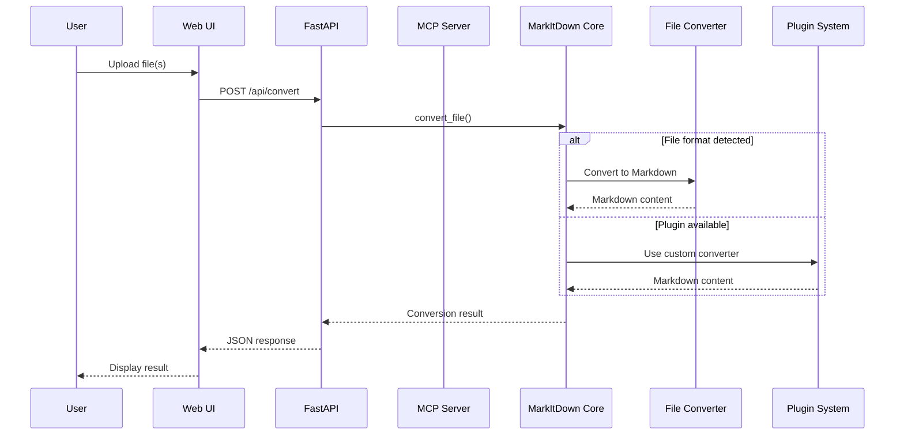
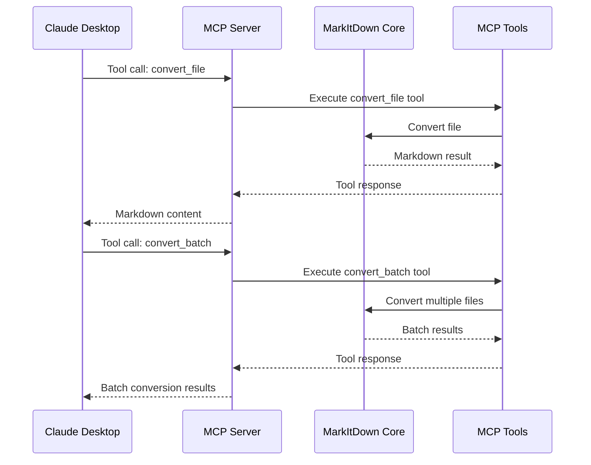
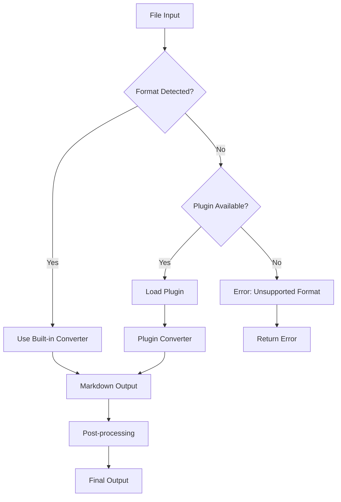
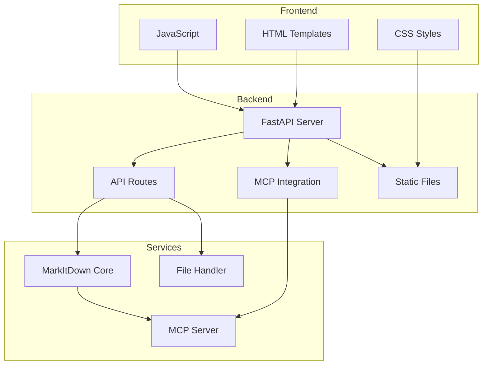
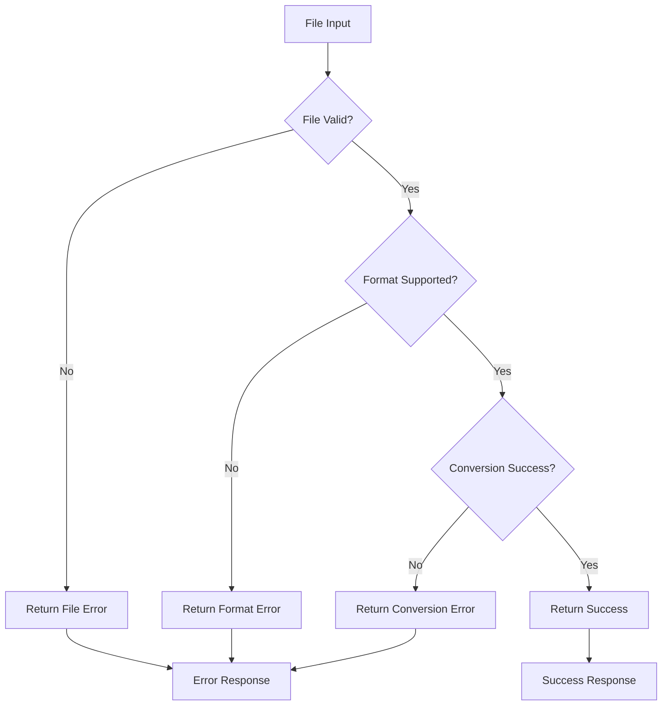
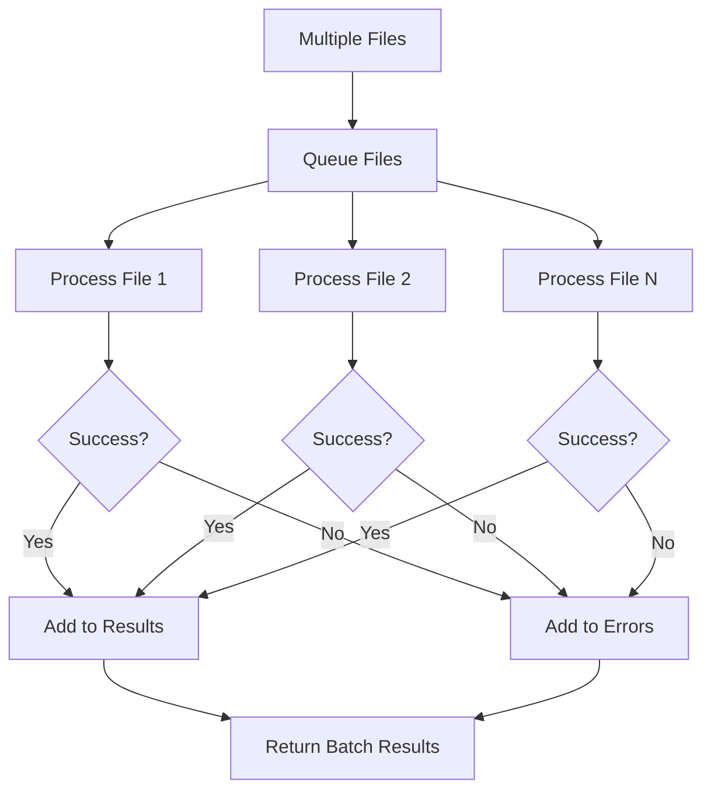
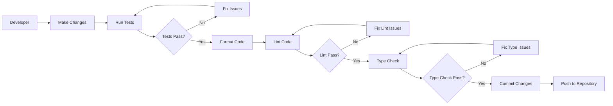
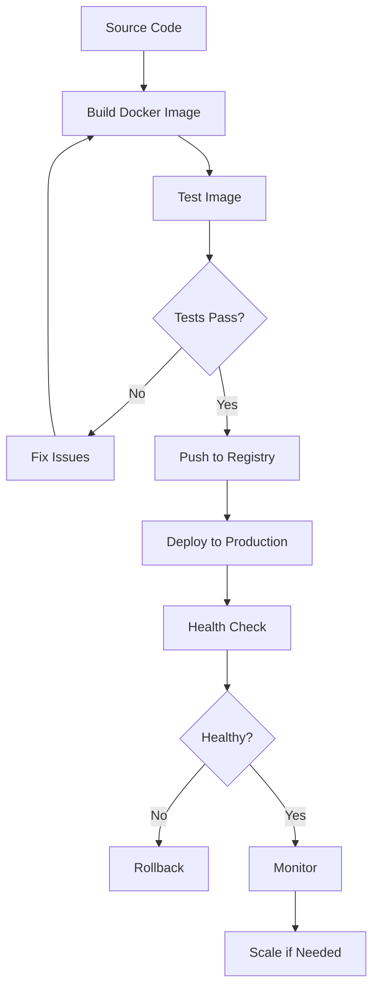
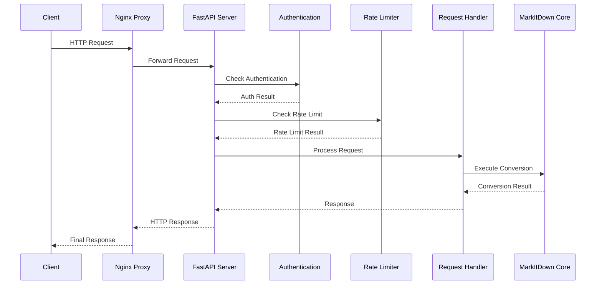
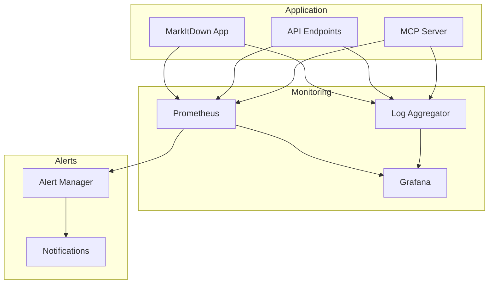

# MarkItDown Workflow Diagrams

This document contains detailed workflow diagrams showing how the different MarkItDown components interact and process files.

## File Conversion Workflow

## MCP Tools Integration Workflow

## Plugin System Workflow

## Web UI Component Architecture

## Error Handling Workflow

## Batch Processing Workflow

## Development Workflow

## Deployment Workflow

## API Request Flow

## Monitoring and Logging

